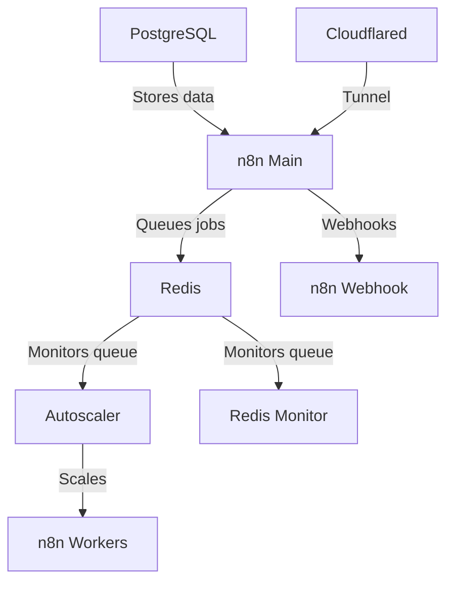

# n8n Autoscaling System

A Docker-based autoscaling solution for n8n workflow automation platform. Dynamically scales worker containers based on Redis queue length. No need to deal with k8s or any other container scaling provider — a simple script runs it all and is easily configurable.

Tested with hundreds of simultaneous executions running on an 8-core 16 GB RAM VPS.

Simple install, just clone the files + docker compose up.

## Task Runner Modes

This build uses **internal mode** by default — task runners run as child processes inside each n8n container. This is faster than external mode (no HTTP/IPC overhead) and requires no separate runner containers.

If you need browser automation (Puppeteer/Playwright) in Code nodes, switch to **external mode** using the files in this repo (`Dockerfile.runner`, `n8n-task-runners.json`). See [Adding External Packages](#adding-external-packages) for details.

## Architecture Overview



### Services

| Service | Description |
|---------|-------------|
| `n8n` | Main n8n instance (editor, API, internal task runner) |
| `n8n-webhook` | Dedicated webhook processor |
| `n8n-worker` | Queue workers (autoscaled, each runs its own internal task runner) |
| `redis` | Job queue |
| `postgres` | Database (with pgvector) |
| `n8n-autoscaler` | Monitors queue and scales workers |
| `redis-monitor` | Queue monitoring |
| `cloudflared` | Cloudflare tunnel |

## Features

- Dynamic scaling of n8n worker containers based on queue length
- **Internal task runners** — no separate runner containers needed
- Shared binary data volume across all n8n containers (main, webhook, worker)
- Configurable scaling thresholds and limits
- Redis queue monitoring
- Docker Compose based deployment
- Health checks for all services
- Extra tools built into the n8n image (ffmpeg, git, jq, curl, graphicsmagick)
- Optional external runner mode with Puppeteer/Playwright/Chromium for browser automation
- Example workflows ready to import

## Prerequisites

- Docker and Docker Compose
- If you are a new user, I recommend either Docker Desktop or using the docker convenience script for Ubuntu
- Set up your Cloudflare domain and subdomains

## Quick Start

1. Clone this repository:
   ```bash
   git clone https://github.com/conor-is-my-name/n8n-autoscaling.git
   cd n8n-autoscaling
   ```

2. Copy the example environment file:
   ```bash
   cp .env.example .env
   ```

3. Configure your environment variables in `.env`:
   - Set strong passwords for `POSTGRES_PASSWORD`, `N8N_ENCRYPTION_KEY`, `N8N_USER_MANAGEMENT_JWT_SECRET`
   - Update domain settings (`N8N_HOST`, `N8N_WEBHOOK`, etc.)
   - Add your `CLOUDFLARE_TUNNEL_TOKEN`
   - Optionally set `TAILSCALE_IP` for private access

4. Create the external network:
   ```bash
   docker network create shark
   ```

5. Start everything:
   ```bash
   docker compose up -d --build
   ```

## Configuration

### Key Environment Variables

| Variable | Description | Default |
|----------|-------------|---------|
| `MIN_REPLICAS` | Minimum number of worker containers | 1 |
| `MAX_REPLICAS` | Maximum number of worker containers | 5 |
| `SCALE_UP_QUEUE_THRESHOLD` | Queue length to trigger scale up | 5 |
| `SCALE_DOWN_QUEUE_THRESHOLD` | Queue length to trigger scale down | 1 |
| `POLLING_INTERVAL_SECONDS` | How often to check queue length | 10 |
| `COOLDOWN_PERIOD_SECONDS` | Time between scaling actions | 10 |

### Task Runner Configuration

| Variable | Description | Default |
|----------|-------------|---------|
| `N8N_RUNNERS_ENABLED` | Enable task runners | true |
| `N8N_RUNNERS_MODE` | `internal` (child process) or `external` (separate container) | internal |
| `N8N_RUNNERS_MAX_CONCURRENCY` | Max concurrent tasks per runner | 10 |

### Timeout Configuration

Adjust these to be greater than your longest expected workflow execution time (in seconds):
```
N8N_QUEUE_BULL_GRACEFULSHUTDOWNTIMEOUT=300
N8N_GRACEFUL_SHUTDOWN_TIMEOUT=300
```

### Binary Data Configuration

| Variable | Description | Default |
|----------|-------------|---------|
| `N8N_DEFAULT_BINARY_DATA_MODE` | Where binary files are stored (`filesystem` or `s3`) | filesystem |
| `N8N_PAYLOAD_SIZE_MAX` | Max payload size in MB | 64 |

> **Important:** In queue mode, all n8n containers (main, webhook, worker) must share the same binary data volume. Otherwise file uploads received by the webhook container won't be accessible to workers. This is handled in the default `docker-compose.yml` — all containers mount the `n8n_main` volume.

## Scaling Behavior

The autoscaler:
1. Monitors Redis queue length every `POLLING_INTERVAL_SECONDS`
2. Scales up when:
   - Queue length > `SCALE_UP_QUEUE_THRESHOLD`
   - Current replicas < `MAX_REPLICAS`
3. Scales down when:
   - Queue length < `SCALE_DOWN_QUEUE_THRESHOLD`
   - Current replicas > `MIN_REPLICAS`
4. Respects cooldown period between scaling actions

## Adding External Packages

### Internal mode (default)

Internal mode runs the task runner as a child process inside n8n. External npm packages aren't supported in internal mode Code nodes unless you install them into the n8n image itself.

### External mode (for browser automation)

If you need Puppeteer, Playwright, or other npm packages in Code nodes, switch to external mode. The repo includes `Dockerfile.runner` and `n8n-task-runners.json` for this purpose.

The following packages are pre-installed in the external runner image:

| Package | Description |
|---------|-------------|
| `puppeteer-core` | Browser automation (Puppeteer) |
| `puppeteer-extra` | Puppeteer with plugin support |
| `puppeteer-extra-plugin-stealth` | Bot detection evasion |
| `playwright-core` | Browser automation (Playwright) |
| `playwright-extra` | Playwright with plugin support |
| `ajv` | JSON schema validation |
| `ajv-formats` | Additional AJV formats |

To add more packages:

1. Edit `Dockerfile.runner` and add packages to the pnpm install:
   ```dockerfile
   RUN /usr/local/bin/node /usr/local/lib/node_modules/corepack/dist/corepack.js pnpm add \
       ajv \
       ajv-formats \
       puppeteer-core@22.15.0 \
       your-package-here
   ```

2. Edit `n8n-task-runners.json` and add your package to the allowlist:
   ```json
   "NODE_FUNCTION_ALLOW_EXTERNAL": "moment,ajv,ajv-formats,puppeteer-core,playwright-core,your-package-here"
   ```

3. Switch `.env` to external mode and add runner services to `docker-compose.yml`:
   ```
   N8N_RUNNERS_MODE=external
   ```

4. Rebuild:
   ```bash
   docker compose build --no-cache
   docker compose up -d
   ```

## Monitoring

The system includes:
- Redis queue monitor service (`redis-monitor`)
- Docker health checks for all services
- Detailed logging from autoscaler

View logs:
```bash
# All services
docker compose logs -f

# Autoscaler
docker compose logs -f n8n-autoscaler

# Workers
docker compose logs -f n8n-worker

# Webhooks
docker compose logs -f n8n-webhook
```

## Updating

See [docs/n8n-version-upgrades.md](docs/n8n-version-upgrades.md) for bumping the pinned n8n Docker image and rolling it out safely.

To update:
```bash
docker compose down
docker compose build --no-cache
docker compose up -d
```

## Troubleshooting

### Check container status
```bash
docker compose ps
```

### Check logs
```bash
docker compose logs [service]
```

### Verify Redis connection
```bash
docker compose exec redis redis-cli ping
```

### Check queue length
```bash
docker compose exec redis redis-cli LLEN bull:jobs:wait
```

### Binary data / file upload issues
If file uploads via forms aren't reaching workers, verify all n8n containers share the same volume:
```bash
docker inspect n8n-autoscaling-n8n-webhook-1 --format '{{range .Mounts}}{{.Name}} -> {{.Destination}}{{end}}'
```
All containers (n8n, n8n-webhook, n8n-worker) should mount `n8n_main` to `/n8n`.

### Webhook URL format
Webhooks use your Cloudflare subdomain:
```
https://webhook.yourdomain.com/webhook/your-webhook-id
```

## File Structure

```
.
├── docker-compose.yml        # Main compose file
├── Dockerfile                # Main n8n image (based on n8nio/n8n, adds ffmpeg/git/jq/curl/gm)
├── Dockerfile.runner         # External task runner image (only needed for external mode)
├── n8n-task-runners.json     # Task runner config for external mode (package allowlist, security)
├── .env.example              # Example environment configuration
├── .env                      # Your configuration (git-ignored)
├── examples/                 # Example n8n workflows (Puppeteer/Playwright)
├── docs/
│   └── n8n-version-upgrades.md  # Guide for bumping the pinned n8n version
├── autoscaler/
│   ├── Dockerfile            # Autoscaler container
│   └── autoscaler.py         # Scaling logic
└── monitor/
    └── monitor.Dockerfile    # Redis monitor container
```

## Example Workflows

The `examples/` folder contains ready-to-import n8n workflows demonstrating browser automation (requires external runner mode):

| File | Description |
|------|-------------|
| `puppeteer-screenshot.json` | Take screenshots with Puppeteer |
| `puppeteer-scrape.json` | Scrape Hacker News with Puppeteer |
| `puppeteer-stealth.json` | Bot detection evasion test |
| `playwright-screenshot.json` | Take screenshots with Playwright |
| `playwright-scrape.json` | Scrape Hacker News with Playwright |
| `playwright-pdf.json` | Generate PDFs from web pages |
| `playwright-stealth.json` | Bot detection evasion test |

Import via: **Workflows** > **Add Workflow** > **Import from File**

## License

MIT License - See [LICENSE](LICENSE) for details.

## Credits

For step-by-step instructions follow this guide: https://www.reddit.com/r/n8n/comments/1l9mi6k/major_update_to_n8nautoscaling_build_step_by_step/
